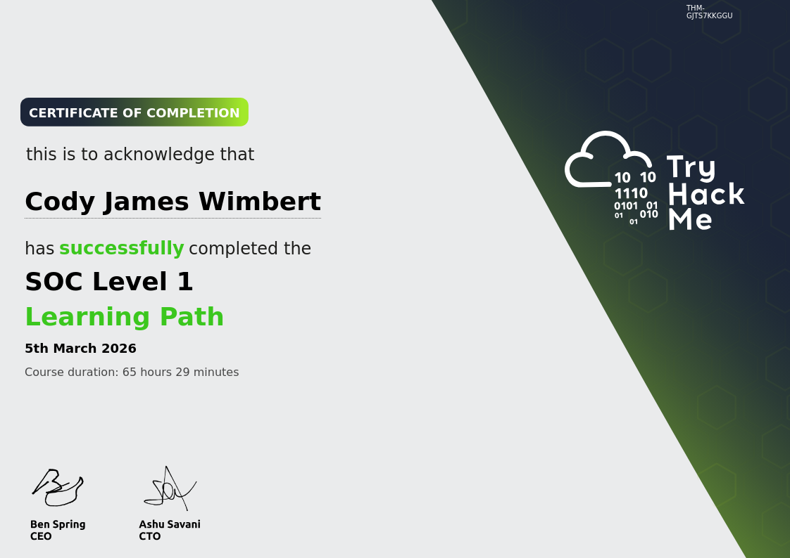

# Cody Wimbert • Professional Portfolio

  <!-- PROFILE CARD (sticky + glow + status + pills) -->
  

    

      
    

    <h1>Cody Wimbert</h1>

    

      
      Active • Security Operations
    

    

      Security Ops • Networking • MSP Infrastructure
    

    <a class="btn linkedin"
       href="https://www.linkedin.com/in/codywimbert"
       target="_blank">
      Connect on LinkedIn
    </a>

    

      Security Ops
      Networking
      MSP
    

  

  <!-- RIGHT SIDE CONTENT -->
  

    <h1 style="margin-top:0;">Professional Overview</h1>

    

      

      

      

      
    

    

      Security Operations Specialist focused on threat detection, incident response, and security monitoring in K–12 enterprise environments.
    

    

      I support public school districts by analyzing and responding to security events using SIEM and EDR platforms, performing threat hunting, managing vulnerability workflows, and tuning detections to improve visibility while reducing false positives. My work is aligned with operational security practices across incident response lifecycles, from initial triage through remediation and reporting.
    

    

      I operate within a broader networked infrastructure environment as part of a security-focused MSP team, where I support security operations that naturally intersect with underlying network systems. While my primary focus is security monitoring and incident response, I draw on my networking background when investigating connectivity-related security events and coordinating with infrastructure teams during troubleshooting and remediation efforts. I hold a CCNA and leverage that foundation to better understand how network behavior impacts security visibility and incident analysis.
    

       

      Previously a classroom educator, I bring strong communication skills that translate technical findings into clear, actionable guidance for both technical teams and non-technical stakeholders across school district environments.
    

  

<h2 class="section-title">Projects</h2>

  <h2>Homelab Infrastructure Overview</h2>
  
Live Network • Home Dashboard Snapshot • Apr 27, 2026

  

    This is my personal homelab environment designed for networking experimentation, automation workflows,
    and security-focused infrastructure testing. It simulates a production-style environment using subnets,
    virtualization, and containerized services.
  

 <!-- Homepage Preview -->

  
  

    Services Homepage (Hosted on Docker)
  

<!-- 🔽 DASHBOARD GRID -->
<h3 style="margin-top:14px;">Live Service Dashboards</h3>

  

      
      
OPNsense Firewall

    

    

      
      
Pi-hole DNS Filtering

    

    

      
      
Proxmox Virtualization

    

    

      
      
Plex Media Server

    

  

  <h3 style="margin-top:20px;">Core Infrastructure</h3>
  <ul>
    <li><strong>OPNsense</strong> – Firewall, routing, and subnet segmentation</li>
    <li><strong>Proxmox</strong> – Virtualization host for all lab workloads</li>
    <li><strong>Pi-hole</strong> – Network-wide DNS filtering and ad blocking</li>
    <li><strong>Portainer</strong> – Docker container management interface</li>
  </ul>
  <h3>Media & Automation Stack</h3>
  <ul>
    <li><strong>Plex</strong> – Media streaming server</li>
    <li><strong>Sonarr</strong> – TV automation and lifecycle management</li>
    <li><strong>Radarr</strong> – Movie automation and acquisition pipeline</li>
    <li><strong>Prowlarr</strong> – Indexer aggregation layer</li>
    <li><strong>qBittorrent</strong> – Download engine for media ingestion</li>
  </ul>
  <h3>Architecture Overview</h3>
  

    The environment is segmented using subnets and routed through OPNsense.
    Proxmox hosts isolated virtual machines and containers, while Docker services
    run application workloads. Media automation is orchestrated through a
    Prowlarr → Sonarr/Radarr → qBittorrent → Plex pipeline.
  

  
  <h3>Home Network Diagram (Homelab Topology)</h3>
  
Lucidchart • Apr 27, 2026

  

    Visual documentation of my home network architecture including WAN edge, OPNsense firewall,
    segmentation, and homelab services hosted across Proxmox and Docker infrastructure.
  

  

    <a class="btn primary" 
       href="assets/docs/REDACTED Home Network_ Lucidchart.pdf"
       target="_blank">
       📄 Open Diagram (PDF)
    </a>
  

  
Preview:

  

    
  

  <a class="preview-link"
     href="https://lucid.app/lucidchart/ee4c169d-b497-4250-9dec-7b47d80b19c3/edit?invitationId=inv_411b3e79-db9a-49c7-ab72-352721c52138"
     target="_blank">
    📌 View Full Network Diagram on Lucidchart ↗
  </a>

  <h3>Primary Compute Stack – Workstation & Homelab Server</h3>
  
PCPartPicker

  

    My main computing environment consists of two dedicated, self-built systems: a Windows-based workstation for web-browsing, management, and virtualization control, and a Proxmox-based homelab server used for running virtual machines, Docker services, and network/security lab environments.
  

  

    <a class="btn primary" 
       href="https://pcpartpicker.com/list/HHhhg3" 
       target="_blank">
       🔗 View Workstation Build
    </a>
    <a class="btn primary" 
       href="https://pcpartpicker.com/list/cWDPn2"
       target="_blank">
       🖥️ View Server Build
    </a>
  

  <h3>TryHackMe – SOC Level 1 Path Completion</h3>
  
TryHackMe • Security Operations • March 5th, 2026

  

    Completed the SOC Level 1 learning path focused on Security Operations Center fundamentals,
    including log analysis, alert triage, SIEM workflows, incident response, and threat detection concepts.
  

  

    <a class="btn primary" 
       href="https://tryhackme.com/" 
       target="_blank">
       🛡️ View TryHackMe Profile
    </a>
  

  

    
  

  <h3>Packet Tracer Demo - Basic Network Setup</h3>
  
YouTube • Sep 21, 2025 • 5:15

  

    Live demo of me setting up a basic Cisco Packet Tracer network and learning along the way.
    Features IP configuration; DNS, DHCP, and HTTP server setup; OSPF configuration; Network troubleshooting.
  

  

    <iframe
      src="https://www.youtube.com/embed/MA3ZNwMtxPw?rel=0&modestbranding=1"
      title="Packet Tracer Lab - Network Setup"
      allowfullscreen>
    </iframe>
  

  <a class="btn youtube" 
     href="https://youtu.be/MA3ZNwMtxPw" 
     target="_blank">
     ▶ Open on YouTube ↗
  </a>

  <h3>VirtualBox Active Directory Lab</h3>
  
PDF • Sep 7, 2025

  

    Step-by-step Active Directory homelab in VirtualBox (install roles, promote to DC, OUs/users, baseline security).
  

  

    <a class="btn primary" href="assets/docs/AD Homelab Documentation.pdf" target="_blank">
      📄 Open Documentation (PDF)
    </a>
  

  
Inline preview:

  

    <iframe src="assets/docs/AD Homelab Documentation.pdf#view=FitH"></iframe>
  

  

    
▶ Watch 7-min overview video

    
YouTube • Aug 25, 2025 • 7:16

    

      <iframe
        src="https://www.youtube-nocookie.com/embed/wJvPo97CihI?rel=0&modestbranding=1"
        title="AD DS Lab Overview"
        allowfullscreen>
      </iframe>
    

  <a class="btn youtube" 
     href="https://youtu.be/wJvPo97CihI" 
     target="_blank">
     ▶ Open on YouTube ↗
  </a>

  

  <h3>File Hashes - Verify Your Downloads</h3>
  
YouTube • Aug 23, 2025 • 5:15

  

    End-user education tutorial on how to check file hashes to verify installs.
  

  

    <iframe
      src="https://www.youtube.com/embed/tgAu_R2t-Zc"
      title="File Hash Verification Tutorial"
      allowfullscreen>
    </iframe>
  

  <a class="btn youtube" 
     href="https://youtu.be/tgAu_R2t-Zc" 
     target="_blank">
     ▶ Open on YouTube ↗
  </a>

