<h1 class="site-title">Cody Wimbert</h1>

Professional Portfolio

  <!-- PROFILE CARD (sticky + glow + status + pills) -->
  

    

      
    

    <h1>Cody Wimbert</h1>

    

      
      Security Operations
    

    

      Security Ops • Networking • MSP
    

    <a class="btn linkedin"
       href="https://www.linkedin.com/in/codywimbert"
       target="_blank">
      Connect on LinkedIn
    </a>

<a class="btn resume-btn"
   href="assets/docs/Cody Wimbert - Resume.pdf"
   target="_blank">
   View Resume
</a>

    

      Security Ops
      Networking
      MSP
    

  

  <!-- RIGHT SIDE CONTENT -->

  

    <h1 style="margin-top:0;">Professional Overview</h1>

    

      

      

      

      
    

    

    <strong>
    Hello there, welcome to my humble web portfolio! The purpose of this page is to document my growth as an IT professional. If you'd like to learn more about my background, please read on. Otherwise, feel free to skip to "Projects" below:
    </strong>
    

    

      I am a lifelong lover of computers and everything technology. However, I didn't always “do” computers as a career. In a past life, I was actually a high school English teacher! This foray into educating our youth was born of the (foolish) notion that one should never do what one loves for a living. Clearly, I was misguided, and it was only through the excruciatingly difficult experience of standing in front of 30+ apathetic teenagers daily for a year straight that I understood this (hats off to you, teachers)!
    

    

      Although I did start by mentioning my lifelong love of computers, I didn't know much about them. To my credit, I built my first PC in high school, played World of Warcraft religiously, and tinkered with old video game consoles. But as anyone in the field knows, this is just Level 1 — no, even less than that. So, when I did finally become fed up with my life as an emotional punching bag, the only option was to hit the books. Hard.
    

    

     I kicked off my journey by pursuing the CompTIA A+, which, according to Redditors, was the ONLY way of getting my foot in the door in the field of Information Technology. Two exams, ~$500, and about a million legacy USB standards memorized later, I was certified (in all seriousness, I really did enjoy the content). Though I wouldn't likely go about this the same way today, I am proud that, for the first time in my life, I chose a direction and stuck to it.
    

    

      Naturally, this small victory generated momentum, helping me pivot from a holdover position as a Head Cashier at Lowe's to a local school district — only this time not as a teacher, but as an IT professional. The job wasn't glorious, but it had its perks. For one, it instilled in me the mindset of a technician and what it means to work in a service-oriented field. Exposure to project lifecycles, asset management strategies, device administration, and responding to user tickets were all valuable experiences for me. Perhaps more importantly, I had a lot of downtime, which allowed me to study even more than I already was. I began homelabbing to put my book knowledge to the test, which spawned this website! And hot on the heels of my A+, I earned my Network+ and Security+, achieving a combination colloquially referred to as the “CompTIA Trifecta.”
    

    

      With those certifications under my belt, I sought greener pastures. This led me to another school (ironic), and the switch earned me the snazzy new title “Junior Network Specialist.” This position was not exactly the jump I was hoping for in terms of pay or responsibilities, but I saw growth potential in a new environment, especially at the MSP I was contracted by. Here, my days consisted mostly of the same mundane tasks I was used to, but there were also many opportunities. As a Junior Network Specialist, I got my hands on some Cisco gear, even decommissioning a faulty switch, applying configurations to a replacement, and installing it in the old one's place. I wrestled with issues WAN and LAN connectivity issues, conducted topology surveys to update port-density documentation, managed users and devices via Active Directory, Jamf, and Google Admin console, terminated CAT cabling to support new infrastructure requirements, and much more! The time I spent in this role helped to grow my confidence, empowered me to take ownership of unfamiliar processes, and encouraged me to study for and earn my CCNA.
    

    

      Ultimately, my gamble on the Junior Network Specialist position paid off. Only six months later, I landed my current role in that same organization as a Cybersecurity specialist protecting K-12 schools (if you can't teach 'em, join 'em). Landing this position may be the most significant milestone of my career. Every day, I am privileged to contribute to a Security Operations team by investigating and responding to security incidents, collaborating across teams to troubleshoot complex security-related issues, and building out additional security service offerings for our districts. I help to facilitate vulnerability assessments and penetration testing aligned with NIST, engage in proactive threat hunting initiatives, optimize playbooks for incident response, validate alerts and tune them for better accuracy and less fatigure, and so much more. Most importantly, I am content. Moreover, I am proud of the hard work put in to get to where I am, and a hundred times more proud than the years put in for my degree in teaching. And of course, this is only the beginning, for <em>"I know that I know nothing."</em>
      

    

      I hope you enjoyed reading this narrative as much as I enjoyed writing it. I also hope this portfolio website challenges you to make your own, or to do something else productive with your time. If you are a fellow career changer or risk taker, I wish you all the best. It is not an easy path, but it is one that has been walked.
    

    

      <strong>Enjoy!</strong>
    

  

  

<h2 class="section-title">Projects</h2>

  <h2>Proxmox VE Virtualized Lab Environment</h2>
  
<strong>Live Network • Home Dashboard Snapshot • May, 2026</strong>

  

    This is my personal homelab environment designed for networking experimentation, automation workflows,
    and security-focused infrastructure testing. It simulates a production-style environment using subnets,
    virtualization, and containerized services.
  

 <!-- Homepage Preview -->

  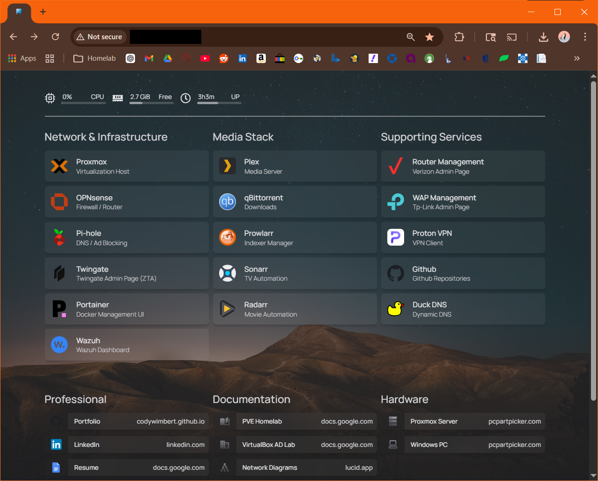

<!-- 🔽 DASHBOARD GRID -->
<h3 style="margin-top:14px;">Live Service Dashboards</h3>

  

      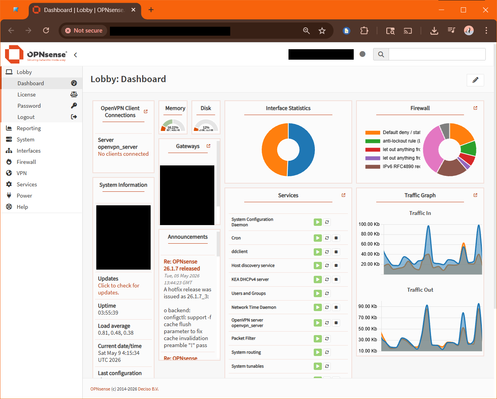
      
OPNsense

    

    

      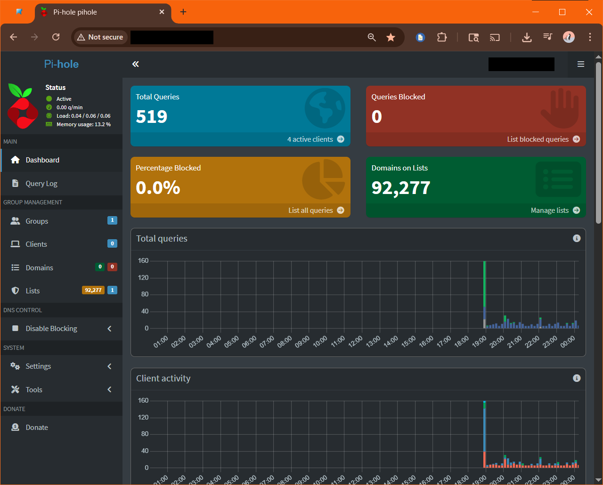
      
Pi-hole DNS Filtering

    

    

      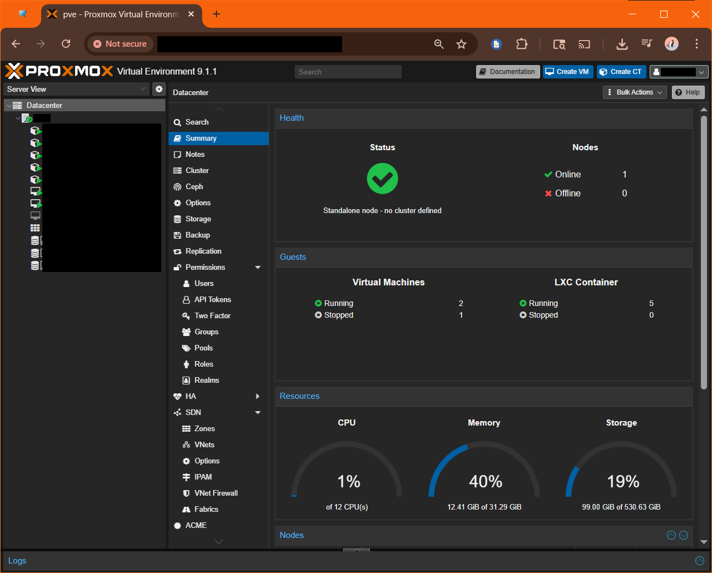
      
Proxmox Virtualization

    

    

      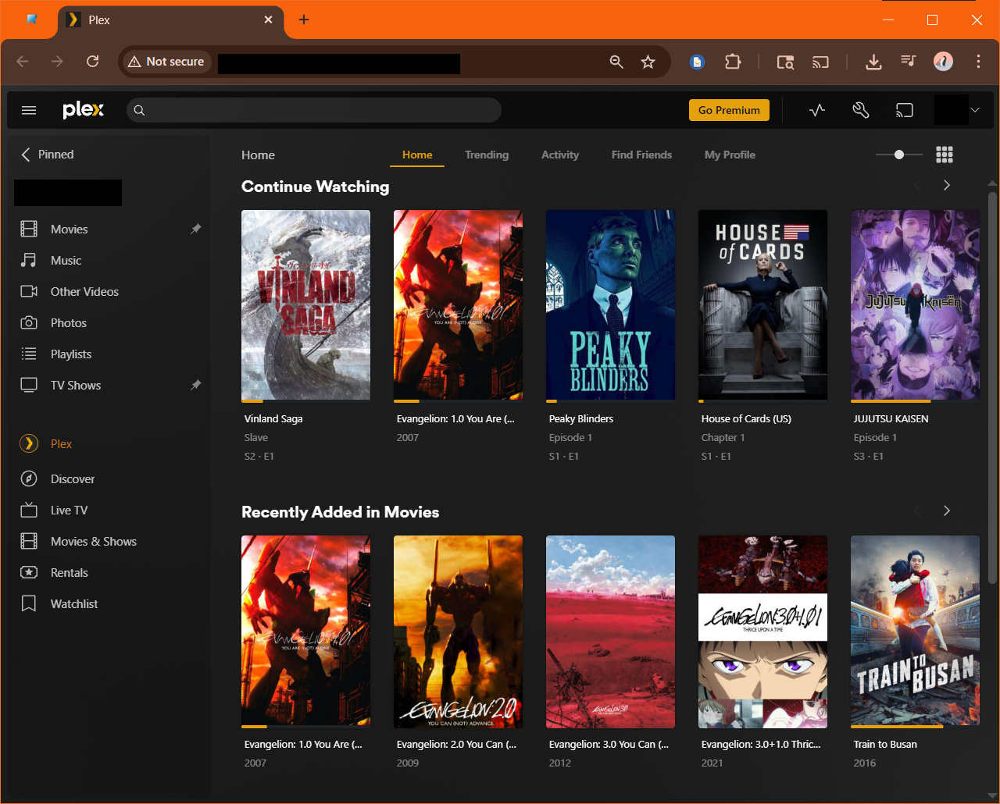
      
Plex Media Server

    

      

      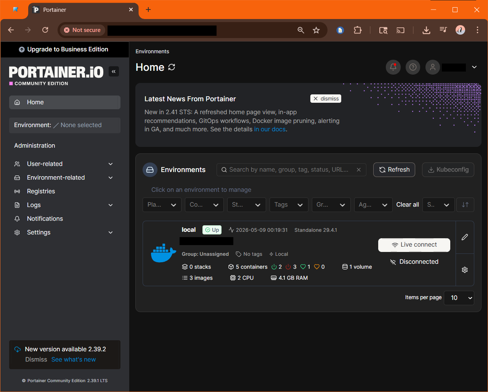
      
Portainer Container Management

    

    

      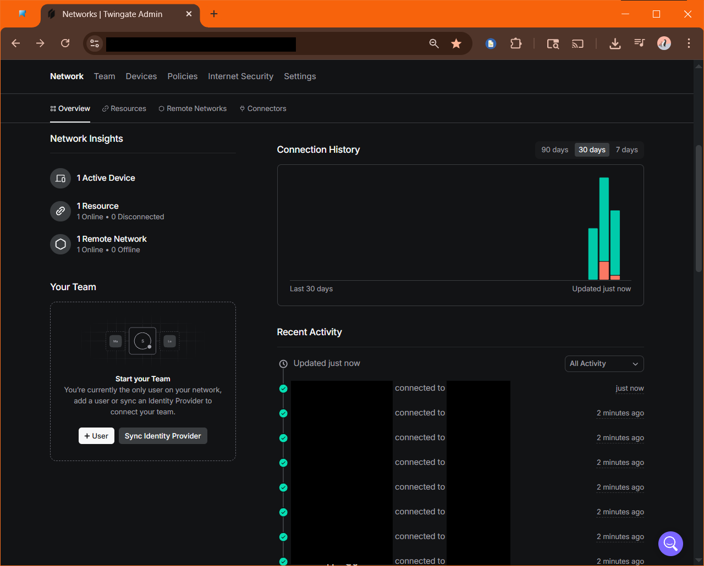
      
Twingate Zero Trust Access

    

    

      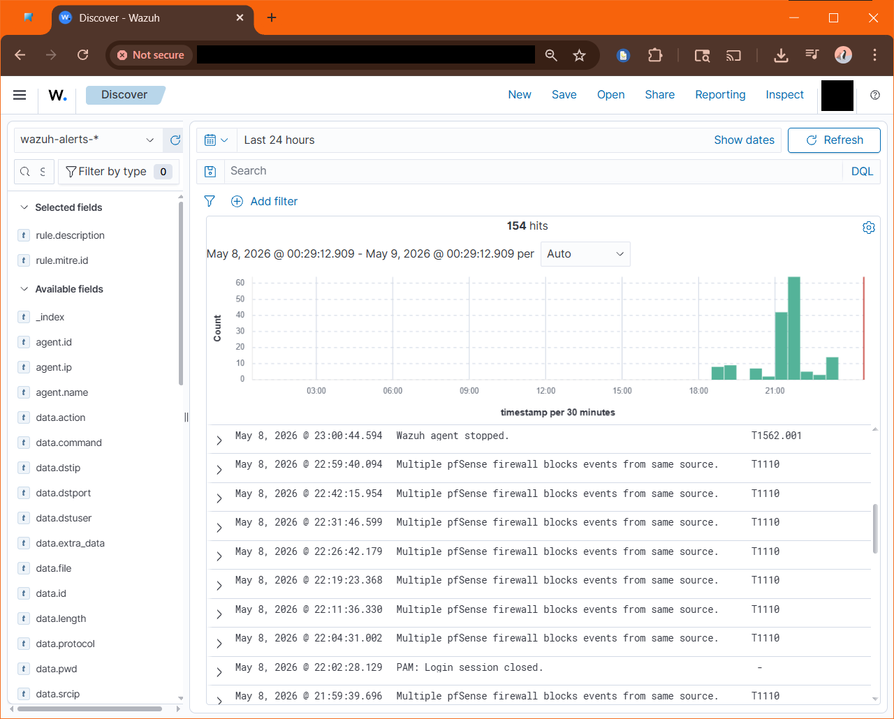
      
Wazuh Security Monitoring

    

    

      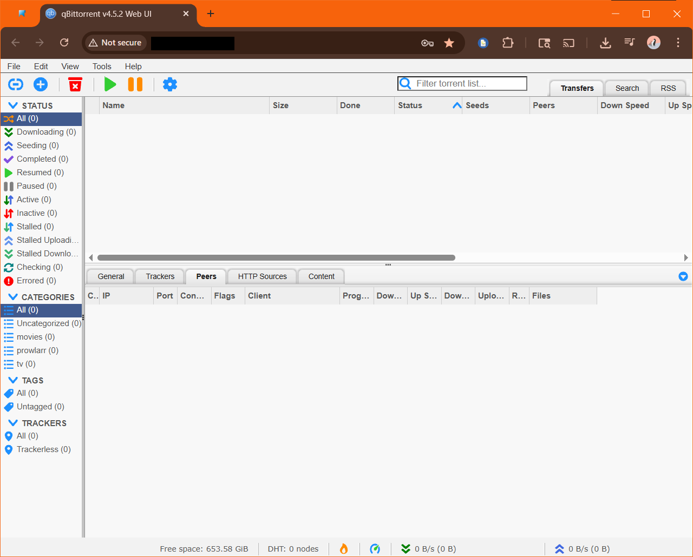
      
qBittorrent Download Engine

    

  
  

  <h3 style="margin-top:20px;">Core Infrastructure</h3>
 <ul>
  <li><strong>Proxmox</strong> – Bare-metal virtualization platform hosting all lab workloads, including VMs and containerized services</li>

  <li><strong>OPNsense</strong> – Network firewall, routing engine, and VPN gateway providing segmentation, traffic control, and perimeter security</li>

  <li><strong>Pi-hole</strong> – Network-wide DNS filtering solution used for ad blocking, domain-level traffic control, and visibility into DNS queries</li>

  <li><strong>Twingate</strong> – Zero Trust access gateway providing authenticated, policy-controlled entry to internal lab services while eliminating direct WAN exposure</li>

  <li><strong>Portainer</strong> – Container management platform for deploying, monitoring, and maintaining Docker workloads across the lab environment</li>

  <li><strong>Wazuh</strong> – Security information and event management (SIEM), endpoint detection and response (EDR), and vulnerability management platform for centralized security monitoring</li>
</ul>
  <h3>Media & Automation Stack</h3>
  <ul>
    <li><strong>Plex</strong> – Media streaming server</li>
    <li><strong>Sonarr</strong> – TV automation and lifecycle management</li>
    <li><strong>Radarr</strong> – Movie automation and acquisition pipeline</li>
    <li><strong>Prowlarr</strong> – Indexer aggregation layer</li>
    <li><strong>qBittorrent</strong> – Download engine for media ingestion</li>
  </ul>
  <h3>Architecture Overview</h3>

  The environment is segmented using subnets and routed through OPNsense.
  Access to lab services is selectively controlled using firewall rules and a Zero Trust access layer via Twingate,
  replacing traditional VPN-based remote access to reduce exposed attack surface.
  Proxmox hosts virtual machines and containers, while Docker services run application workloads.
  Media automation is orchestrated through a Prowlarr → Sonarr/Radarr → qBittorrent → Plex pipeline.
  Security events are monitored within Wazuh, which also provides vulnerability management and centralized security visibility across lab services.

  <h3>Wazuh SIEM, EDR & Vulnerability Management Stack</h3>
  
<strong>Self-Hosted Security Monitoring Lab • May, 2026</strong>

  

    Built and deployed a full Wazuh security monitoring stack for centralized log analysis, endpoint detection,
    and vulnerability visibility across a segmented home lab environment. This project simulates enterprise SIEM
    workflows including log ingestion, detection rule creation, and multi-source correlation between firewall,
    endpoints, and system telemetry.
  

  <!-- DASHBOARD IMAGE -->
  

  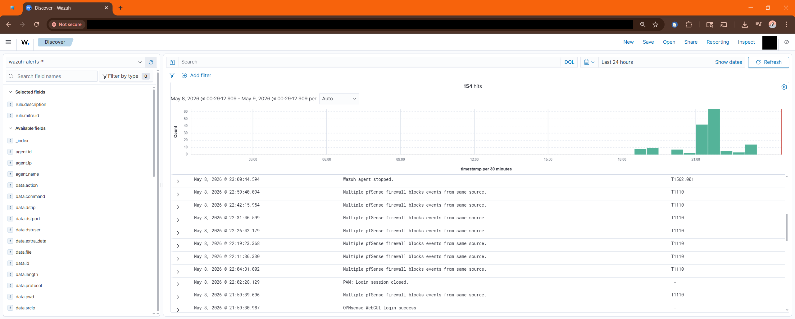

  <h3 style="margin-top:14px;">Architecture Overview</h3>
  <ul>
    <li><strong>Wazuh Manager / Indexer / Dashboard</strong> – Central SIEM stack deployed on a dedicated Linux container</li>
    <li><strong>Firewall Integration</strong> – OPNsense logs forwarded via syslog and agent-based collection</li>
    <li><strong>Endpoint Agents</strong> – Linux agents deployed across lab systems for host-level visibility</li>
    <li><strong>OpenSearch Dashboards</strong> – Used for indexing, search, and log visualization</li>
    <li><strong>Syslog Ingestion</strong> – Network device telemetry routed into centralized log storage</li>
  </ul>

  <h3>Deployment Summary</h3>
  <ul>
    <li>Deployed Wazuh stack using official community installation method on a Linux container</li>
    <li>Enabled full log archival for forensic visibility and detection engineering</li>
    <li>Validated log ingestion using real-time archive and manager logs</li>
    <li>Confirmed firewall-to-SIEM event flow through syslog and agent integration</li>
  </ul>

  <h3>Firewall & Network Integration</h3>
  <ul>
    <li>Installed Wazuh agent plugin on firewall system via official community package repository</li>
    <li>Configured secure log forwarding from firewall to SIEM stack</li>
    <li>Enabled syslog ingestion for network and authentication events</li>
    <li>Restricted log ingestion to internal lab network ranges</li>
  </ul>

  <h3>Detection Engineering</h3>
  

    Developed custom detection rules to identify authentication and administrative events from firewall logs.
    Logs were analyzed using Wazuh’s built-in log testing utility to extract structured fields for rule creation.
  

  <ul>
    <li>Built custom rule to detect successful web interface logins</li>
    <li>Parsed raw syslog events into structured detection logic</li>
    <li>Implemented alerting based on authentication and administrative activity</li>
    <li>Restarted and validated rule behavior within SIEM pipeline</li>
  </ul>

  <h3>Endpoint Deployment</h3>
  <ul>
    <li>Installed and configured Wazuh agents on multiple Linux endpoints</li>
    <li>Registered agents to central manager for telemetry collection</li>
    <li>Enabled persistent monitoring of system and security events</li>
    <li>Verified agent connectivity and event transmission</li>
  </ul>

  <h3>Security Notes</h3>
  

    Sensitive details such as internal access endpoints, credentials, and authentication information have been
    intentionally omitted. The environment is fully isolated within a private lab network and designed to simulate
    enterprise SIEM workflows without exposing operational security details.
  

  <h3>Home Network Diagram (Homelab Topology)</h3>
  
<strong>Lucidchart • April, 2026</strong>

  

    Visual documentation of my home network architecture including WAN edge, OPNsense firewall,
    segmentation, and homelab services hosted across Proxmox and Docker infrastructure.
  

  

    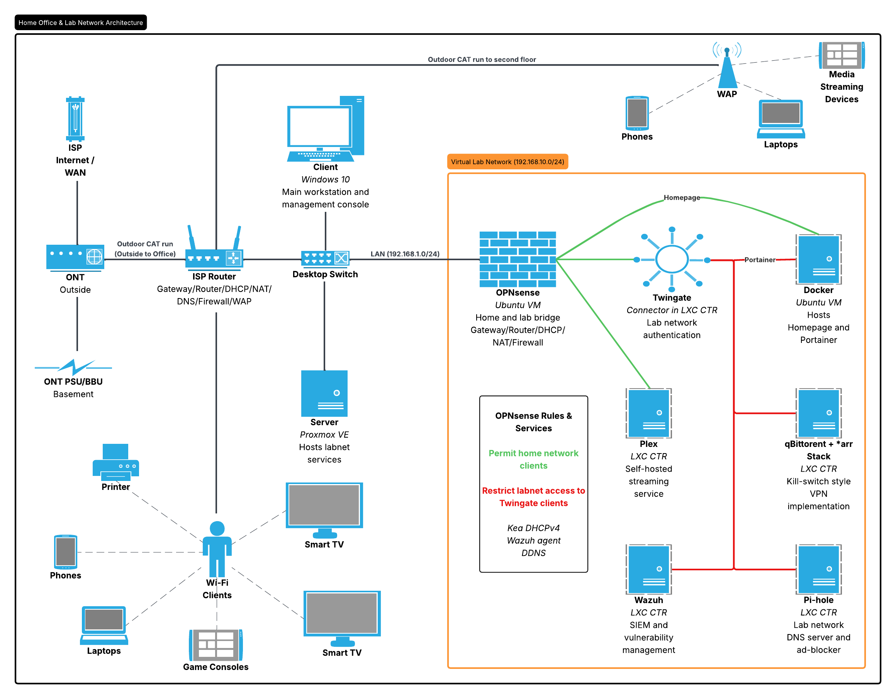
  

  <a class="preview-link"
     href="https://lucid.app/lucidchart/ee4c169d-b497-4250-9dec-7b47d80b19c3/edit?invitationId=inv_411b3e79-db9a-49c7-ab72-352721c52138"
     target="_blank">
    View Full Network Diagram on Lucidchart
  </a>

  <h3>Primary Compute Stack – Workstation & Homelab Server</h3>
  
<strong>PCPartPicker</strong>

  

    My main computing environment consists of two dedicated, self-built systems: a Windows-based workstation for web-browsing, management, and virtualization control, and a Proxmox-based homelab server used for running virtual machines, Docker services, and network/security lab environments.
  

  

    <a class="btn primary" 
       href="https://pcpartpicker.com/list/HHhhg3" 
       target="_blank">
       🔗 View Workstation Build
    </a>
    <a class="btn primary" 
       href="https://pcpartpicker.com/list/cWDPn2"
       target="_blank">
       🖥️ View Server Build
    </a>
  

  <h3>TryHackMe – SOC Level 1 Path Completion</h3>
  
<strong>TryHackMe • Security Operations • March, 2026</strong>

  

    Completed the SOC Level 1 learning path focused on Security Operations Center fundamentals,
    including log analysis, alert triage, SIEM workflows, incident response, and threat detection concepts.
  

  

    <a class="btn primary" 
       href="https://tryhackme.com/" 
       target="_blank">
       🛡️ View TryHackMe Profile
    </a>
  

  

    <a href="https://tryhackme.com/" target="_blank">
      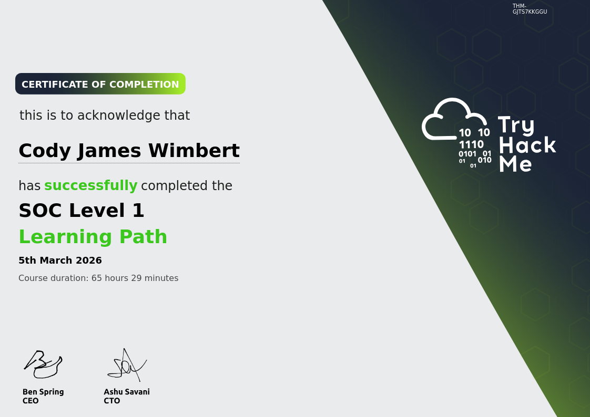
    </a>
  

<!-- Packet Tracer -->

  <h3>Packet Tracer Demo - Basic Network Setup</h3>
  
<strong>YouTube • September, 2025 • 5:15</strong>

  

    Live demo of me setting up a basic Cisco Packet Tracer network and learning along the way.
    Features IP configuration; DNS, DHCP, and HTTP server setup; OSPF configuration; Network troubleshooting.
  

  

    <iframe
      src="https://www.youtube.com/embed/MA3ZNwMtxPw?rel=0&modestbranding=1"
      title="Packet Tracer Lab - Network Setup"
      allowfullscreen>
    </iframe>
  

  

    <a class="btn youtube"
       href="https://youtu.be/MA3ZNwMtxPw"
       target="_blank">
      ▶ Open on YouTube ↗
    </a>
  

<!-- AD Lab -->

  <h3>VirtualBox Active Directory Lab</h3>

  
<strong>PDF • September, 2025</strong>

  

    Step-by-step Active Directory homelab in VirtualBox (install roles, promote to DC, OUs/users, baseline security).
  

  

    <a class="btn primary" href="assets/docs/AD Homelab Documentation.pdf" target="_blank">
      📄 Open Documentation (PDF)
    </a>
  

  

    <iframe src="assets/docs/AD Homelab Documentation.pdf#view=FitH"></iframe>
  

  

    <iframe
      src="https://www.youtube-nocookie.com/embed/wJvPo97CihI?rel=0&modestbranding=1"
      title="AD DS Lab Overview"
      allowfullscreen>
    </iframe>
  

  

    <a class="btn youtube"
       href="https://youtu.be/wJvPo97CihI"
       target="_blank">
      ▶ Open on YouTube ↗
    </a>
  

<!-- File Hashes -->

  <h3>File Hashes - Verify Your Downloads</h3>
  
<strong>YouTube • August, 2025 • 5:15</strong>

  

    End-user education tutorial on how to check file hashes to verify installs.
  

  

    <iframe
      src="https://www.youtube.com/embed/tgAu_R2t-Zc"
      title="File Hash Verification Tutorial"
      allowfullscreen>
    </iframe>
  

  

    <a class="btn youtube"
       href="https://youtu.be/tgAu_R2t-Zc"
       target="_blank">
      ▶ Open on YouTube ↗
    </a>
  

